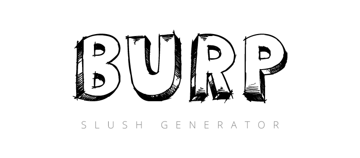

[](https://bitdeli.com/free "Bitdeli Badge")

> A modern and as fast as a burp slush-generator that scaffolds out a [BURP Template](https://github.com/acauamontiel/burp)


Getting Started
---------------

### Installation

Install `slush-burp` globally:

```bash
$ npm install -g slush-burp
```

### Usage

Create a new folder for your project:

```bash
$ mkdir my-slush-burp
```

Run the generator from within the new folder:

```bash
$ cd my-slush-burp && slush burp
```

---

Getting To Know Slush
---------------------

Slush is a tool that uses Gulp for project scaffolding.

Slush does not contain anything "out of the box", except the ability to locate installed slush generators and to run them with liftoff.

To find out more about Slush, check out the [documentation](https://github.com/klei/slush).


Contributing
------------

See the [CONTRIBUTING Guidelines](https://github.com/acauamontiel/slush-burp/blob/master/CONTRIBUTING.md)


Support
-------
If you have any problem or suggestion please open an issue [here](https://github.com/acauamontiel/slush-burp/issues).


License
-------

© 2014 Acauã Montiel

[MIT License](http://acaua.mit-license.org/)
